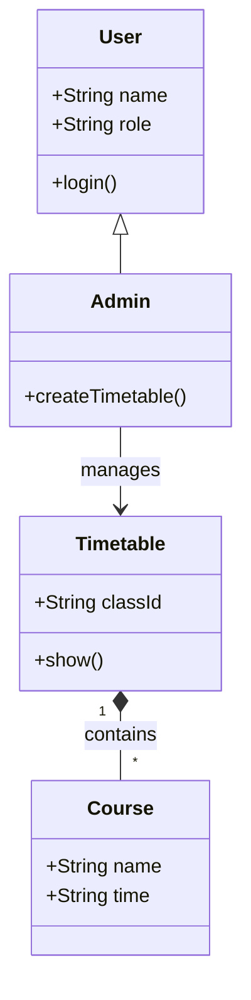
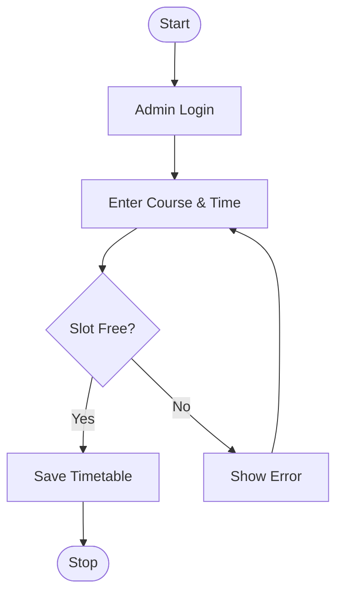
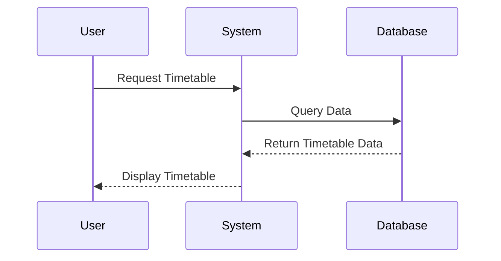

# Time Table Management System Diagrams

Here are the simple UML diagrams for a Time Table Management System using Mermaid syntax. You can view these diagrams by opening the VS Code Preview (Ctrl+Shift+V).

## 1. Use Case Diagram
Shows the interactions between users (Actors) and the system.

```mermaid
usecaseDiagram
    actor Admin
    actor Teacher
    actor Student

    package "Time Table System" {
        usecase "Create Timetable" as UC1
        usecase "View Timetable" as UC2
    }

    Admin --> UC1
    Admin --> UC2
    Teacher --> UC2
    Student --> UC2
```

## 2. Class Diagram
Shows the structure of the system, classes, and their relationships.



## 3. Activity Diagram
Shows the flow of creating a timetable (Admin workflow).



## 4. Sequence Diagram
Shows the sequence of messages when a user views a timetable.


